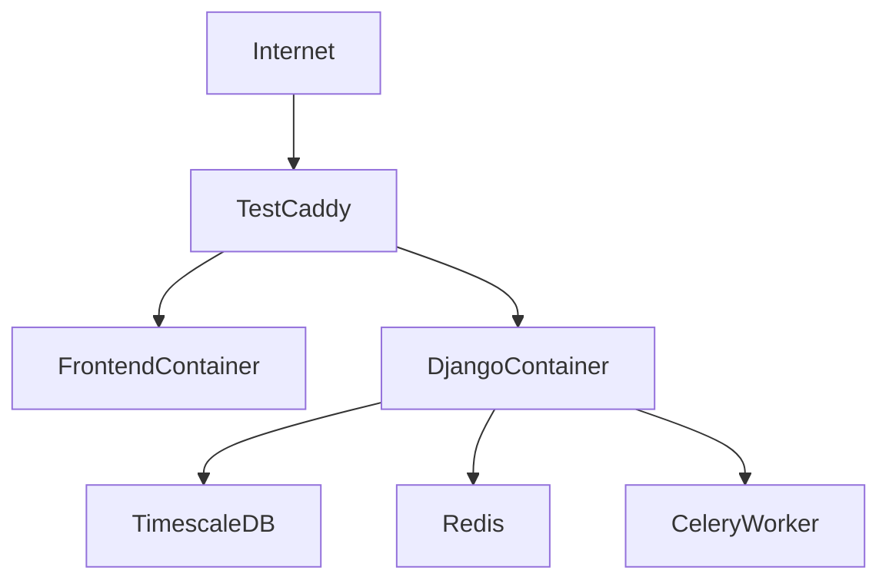

# AquaMind Frontend Deployment Architecture

This document distinguishes between the **current shared test deployment** and a
possible **future production network architecture**.

## Current Shared Test Deployment

The shared test environment is intentionally lightweight:

- one public hostname: `https://test.bakkamind.com`
- one external ingress: Caddy
- frontend container serves the SPA on the internal Docker network
- backend Django container serves API and admin routes on the internal Docker network
- Caddy routes:
  - `/` to the frontend container
  - `/api/*` to Django
  - `/admin/*` to Django
  - `/health-check/` to Django
  - `/static/*` and `/media/*` from shared Docker volumes



### Frontend Runtime Expectations

- the frontend image is built in CI and pulled from GHCR
- the SPA should behave primarily as a same-origin app behind Caddy
- the frontend container's internal nginx config still proxies `/api/` to `web:8000`
- frontend runtime code now falls back to `window.location.origin` when
  `VITE_DJANGO_API_URL` is not set, which reduces environment-specific image drift

### Test Deployment Goals

- no extra nginx layer in front of Caddy
- no server-side rebuilds for normal deploys
- rollback by image tag
- one repeatable deploy checklist

## Future Production Architecture

Production may later move to a more segmented design, for example:

- frontend in a DMZ
- backend on an internal VLAN
- database managed separately from app containers
- stricter firewall policy between tiers

That remains a valid target architecture, but it is not the current shared test
deployment and should not be mixed with test runbooks.

## CI and Image Flow

The frontend deployment contract is:

1. `frontend-ci.yml` runs tests and type checking
2. `docker-build-frontend.yml` builds and publishes `ghcr.io/.../frontend:<tag>`
3. the test server pulls the chosen tag during deployment

## Environment Notes

### Local development

```env
VITE_USE_DJANGO_API=true
VITE_DJANGO_API_URL=http://localhost:8000
PORT=5001
```

### Shared test

The preferred behavior is same-origin via Caddy:

```env
VITE_USE_DJANGO_API=true
```

If an explicit API base is needed during image build, use:

```env
VITE_DJANGO_API_URL=https://test.bakkamind.com
```

### Future production example

```env
VITE_USE_DJANGO_API=true
VITE_DJANGO_API_URL=https://api.aquamind.internal
```

## Remaining Technical Debt

The frontend is much closer to same-origin deployment than before, but keep in
mind:

- some internal container routing still depends on `web:8000`
- the frontend deployment story should stay aligned with the backend test
  environment docs
- if production diverges into DMZ/VLAN, document that as a separate target-state
  design rather than reusing the shared test runbook